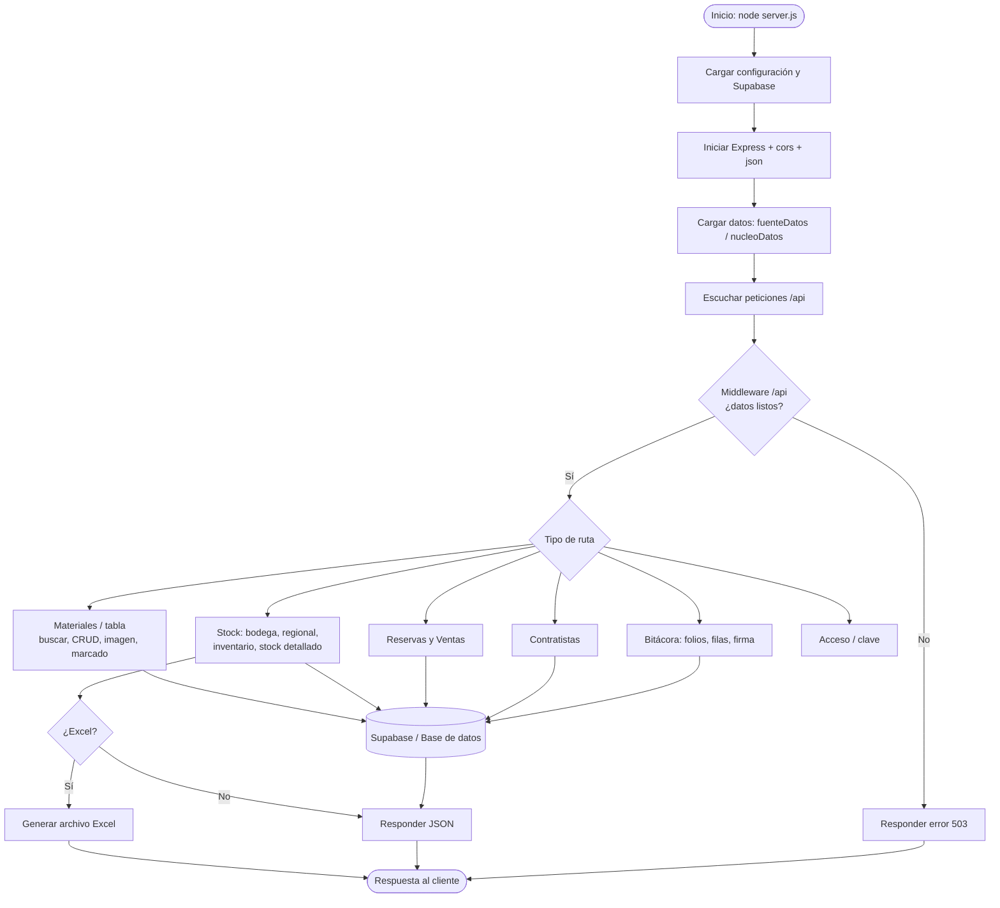

# Diagrama de flujo - Programa Back (server.js)

```mermaid
flowchart TD
    A([Inicio: node server.js]) --> B[Cargar configuración y Supabase]
    B --> C[Iniciar Express + cors + json]
    C --> D[Cargar datos: fuenteDatos / nucleoDatos]
    D --> E[Escuchar peticiones /api]
    E --> F{Middleware /api<br/>¿datos listos?}
    F -- No --> G[Responder error 503]
    F -- Sí --> H{Tipo de ruta}
    H --> I[Materiales / tabla<br/>buscar, CRUD, imagen, marcado]
    H --> J[Stock: bodega, regional,<br/>inventario, stock detallado]
    H --> K[Reservas y Ventas]
    H --> L[Contratistas]
    H --> M[Bitácora: folios, filas, firma]
    H --> N[Acceso / clave]
    I --> O[(Supabase / Base de datos)]
    J --> O
    K --> O
    L --> O
    M --> O
    J --> P{¿Excel?}
    P -- Sí --> Q[Generar archivo Excel]
    P -- No --> R[Responder JSON]
    O --> R
    Q --> S([Respuesta al cliente])
    R --> S
    G --> S
```
