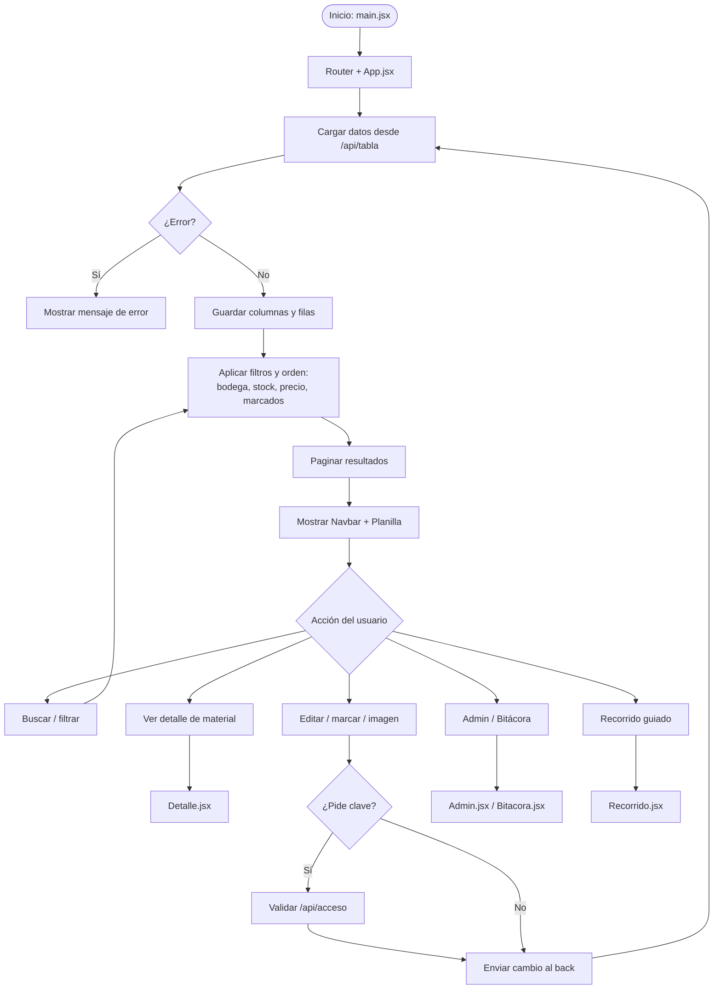

# Diagrama de flujo - Programa Web (React)

```mermaid
flowchart TD
    A([Inicio: main.jsx]) --> B[Router + App.jsx]
    B --> C[Cargar datos desde /api/tabla]
    C --> D{¿Error?}
    D -- Sí --> E[Mostrar mensaje de error]
    D -- No --> F[Guardar columnas y filas]
    F --> G[Aplicar filtros y orden:<br/>bodega, stock, precio, marcados]
    G --> H[Paginar resultados]
    H --> I[Mostrar Navbar + Planilla]
    I --> J{Acción del usuario}
    J --> K[Buscar / filtrar] --> G
    J --> L[Ver detalle de material] --> M[Detalle.jsx]
    J --> N[Editar / marcar / imagen] --> O{¿Pide clave?}
    O -- Sí --> P[Validar /api/acceso]
    P --> Q[Enviar cambio al back]
    O -- No --> Q
    Q --> C
    J --> R[Admin / Bitácora] --> S[Admin.jsx / Bitacora.jsx]
    J --> T[Recorrido guiado] --> U[Recorrido.jsx]
```
